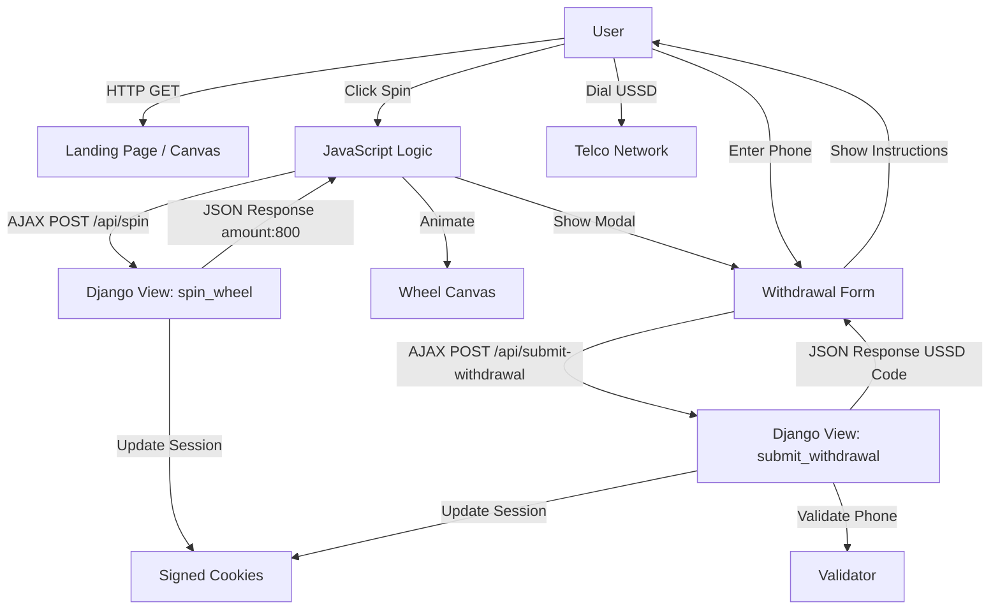

# Project Blueprint: Skiza Spin & Win

## 1. Architecture Overview

### High-Level Design
The application follows a **Monolithic Django Architecture** served with **Gunicorn** and **WhiteNoise** for static files. The frontend is a **Single Page Experience** (on the landing page) that uses AJAX to communicate with the backend, providing a fluid "App-like" feel.

### Data Flow

## 2. User Experience (UX) Blueprint

### 2.1 The Hook (Landing)
- **Visuals**: Dark themed, premium aesthetic (Red/Gold).
- **Elements**: 
  - Large animated Spin Wheel (Canvas).
  - Clear Call-to-Action (CTA): "SPIN THE WHEEL".
  - Floating toast notifications for social proof (if implemented).
  - "How It Works" section for trust.

### 2.2 The Action (Spin)
- **Interaction**: Click "SPIN".
- **Feedback**: Wheel spins for ~2 seconds. Sound effects (optional).
- **Result**: Wheel lands on 800. Confetti effect (in modal).
- **Transition**: Immediate opening of "Congratulations" Modal.

### 2.3 The Conversion (Withdrawal & Subscription)
- **Step 1 (Input)**: Modal asks for Phone Number. "Enter to claim Kshs 800".
- **Action**: User submits.
- **Step 2 (Instruction)**: Modal transitions to "Subscribe to Withdraw".
  - Shows Amount: Kshs 800.
  - Shows USSD: `*860*860#`.
  - Primary Button: "Dial" (opens tel: link).

## 3. Component Breakdown

| Component | Responsibility | Tech Stack |
|-----------|----------------|------------|
| **WheelCanvas** | Rendering and animating the wheel based on logic. | HTML5 Canvas, JS |
| **SpinController** | Managing spin state (spinning, won), disabling buttons. | Vanilla JS |
| **WithdrawalModal** | Multi-step form handling (Phone Input -> USSD Display). | HTML, Tailwind, JS |
| **SessionManager** | Backend session handling (preventing multi-spins per session). | Django Sessions |
| **ValidationService** | Ensuring phone numbers are valid Kenyan formats. | Django Validators |

## 4. Implementation Plan (Roadmap)

### Phase 1: Stability & Clean-up (Current)
- [x] Implement core Spin & Win logic.
- [x] Implement "No-DB" flow for speed.
- [ ] Fix `processing_confirmation` logic mismatch (remove or update).
- [ ] Ensure `render.yaml` and `build.sh` are perfectly tuned for deployment.

### Phase 2: Analytics & Persistence (Recommended)
- [ ] Re-introduce `WithdrawalRequest` logging (asynchronous/non-blocking) to track:
    - Unique phone numbers.
    - Conversion rates (Spin vs Withdrawal Request).
- [ ] Add an Admin Dashboard export feature to download phone numbers for follow-up marketing.

### Phase 3: Engagement Features
- [ ] Add real "Recent Winners" ticker (simulated or real).
- [ ] Add SMS integration (Africa's Talking / Twilio) to send the USSD code directly to the user's phone as a backup.
